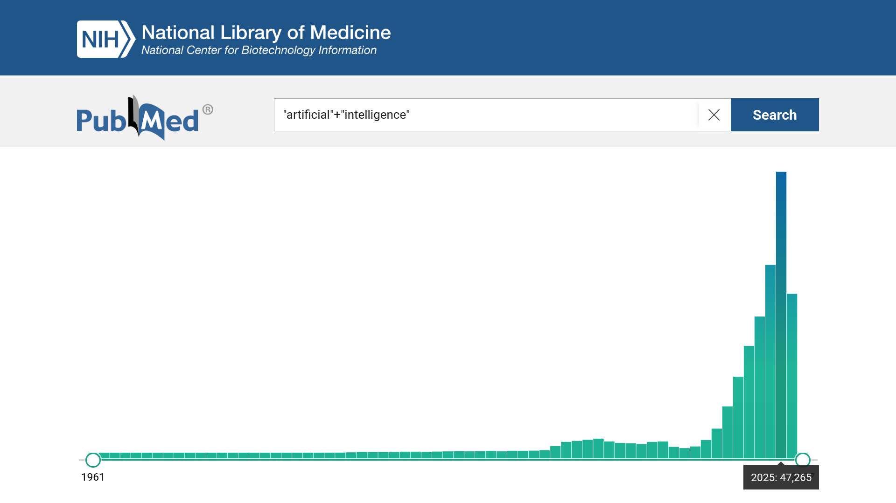
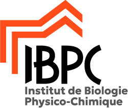
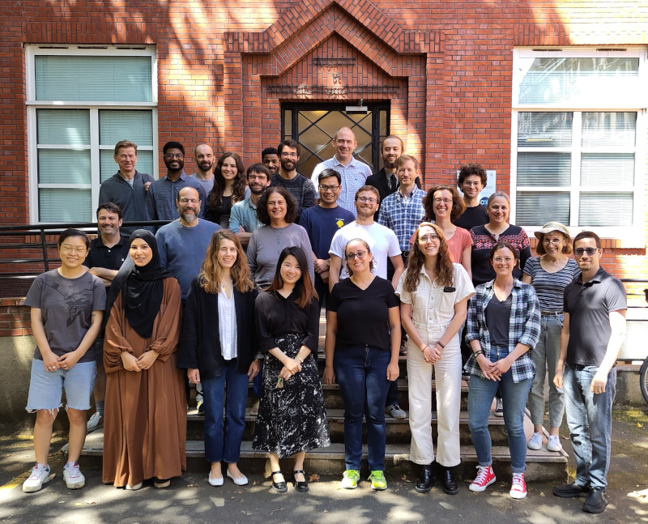

+++
title = "JOBIM 2026"
date = 2026-06-03
description = "Visualization-driven pipeline for drug-design through generative AI"
theme="./static/style.css"
code_theme="lightfair"
+++

===

# Drug-design: cost and time-consuming

 

Review by Steven M. PAUL _et al._ in 2010\* shows:

- 2.8 billion USD of investissement
- 14 years to make a drug

 

> \*Paul, S. _et al._ How to improve R&D productivity: the pharmaceutical
> industry's grand challenge. Nat Rev Drug Discov 9, 203–214 (2010).
> https://doi.org/10.1038/nrd3078 {.small_note}

===

# AI is the solution?

===

# Interpretability problem…

 

black box

---



<split>

<split>

<split>
 

 

# Visualization-driven pipeline for drug-design through generative AI

**Lucas ROUAUD**\
3rd year PhD student

 



**Director:** Marc BAADEN\
**Codirector:** Antoine TALY

<split>

IBPC - LBT - UMR 8266 UPC/CNRS\
ED 388



---



---



---



---



---



---



---

# Thanks for your attention!

