+++
title = "Soutenance de thèse"
date = 2026-10-23
description = "Combinaison de méthodes de visualisation à de l'IA générative dans le cadre du drug design"
theme="./static/style.css"
code_theme="lightfair"
+++

# Je ne sais qu'une chose,   c'est que je ne sais rien

**— Socrate**

---

# Conception de médicaments

 

- Un enjeu sanitaire et économique important ;

- requiert des investissements de long terme et financièrement lourd :

    - une durée pouvant aller jusqu'à 14 ans ;

    - des revues relèvent des investissements financiers allant de 314 millions USD à 2,8 millards USD.

===

# Aucune garantie de succès

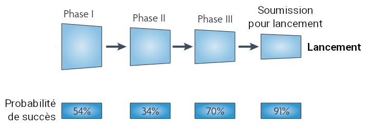

**© Steven M. PAUL et collaborateur, 2010, _modifiée_**

===

# Contrer cela : développement de nouvelles méthodes

- Développement de nouvelles méthodes informatiques, comme l'amarrage moléculaire ;

- augmentation des tailles des bases de données (comme la PDB avec des structures protéiques) ;

- amélioration des systèmes informatiques.

===

# Apparition de l'intelligence artificielle (IA) générative

 

- Concepte datant de 1913 avec les chaînes de Markov :

    - probabilités d'enchaînement des lettres ne sont pas indépendantes ;

    - il est possible de générer une matrice d'enchaînement de ces lettres ;

    - à partir de cette matrice, la génération de texte devient possible.

> **Objectif global d'une IA générative identique**
>
> Déterminer une distribution soujacente à des objets donnés (texte, image, etc.) pour pouvoir en générer d'autres.

===

# Plusieurs modèle, un cœur commun

- Il y a plusieurs modèles d'IA générative _(modèle de diffusion, auto-encodeur varioationnel, réseaux antagonistes génératifs, transformeurs génératifs préentraînés)_ ;
- tous basés sur les neurones artificiels, l'origine de la qualification de ces modèles de « boîte noire ».

 
 

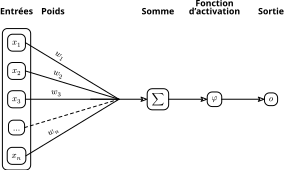

===

# Apparition de l'IA explicable

- Faire en sorte de pouvoir comprendre et interpréter l'origine des résultats obtenus ;

- différentes méthodes :
    
    - explicabilité des données ;

    - explicabilité par le modèle ;

    - analyses _post hoc_ ;

    - utilisation de moyens de visualisations.

---



<split>

<split>

<split>



 

# Combinaison de méthodes de visualisation à de l’intelligence artificielle générative dans le cadre de conception de médicament
 

**Lucas ROUAUD**\
23 octobre 2026

 



**Directeur:** Marc BAADEN\
**Codirecteur:** Antoine TALY

<split>

IBPC - LBT - UMR 8266 UPC/CNRS\
ED 388



---

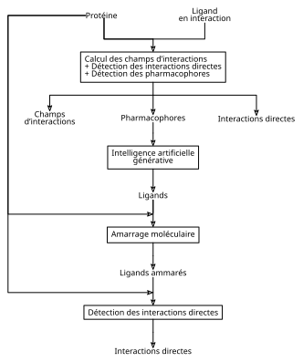

---

# Présentation du système



- Récepteur à l'acide gamma-amino butyrique de type A (récepteur GABA A) ;

- système complexe bien connue : canal ionique hétéropentamère, transmembranaire et allostérique ;

- constitué de trois types de sous-unités, ayant plusieurs variants ($\alpha$ 1-6, $\beta$ 1-3, $\gamma$ 1-3, $\delta$, $\pi$ et $\theta$) ;

- fixation de GABA provoque l'influx d'ions chlorures, empêchant la création d'un potentiel d'action, bloquant la transduction d'un signal nerveux.

<split>

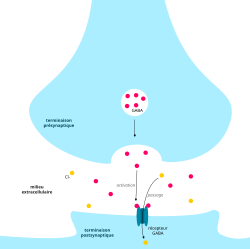


===

## Étude du complexe récepteur GABA A avec le diazépam

- Étude du diazépam, un benzodiazépine :

    - rôle relaxant et anticonvlusant ;

    - possède différents effets secondaires, comme la dépendance physique.

> **Objectif**
>
> Retrouver un analogue du diazépam, soit une molécule ayant des propriétés physico-chimiques semblables.

===

## Structure



---

===

# Préparation du système

 

- Important pour plusieurs raisons :

    - l'amarrage moléculaire est dépendant du système de départ ;

    - pour les calculs des interactions (champs et directes), besoin d'avoir les hydrogènes et une structure complète ;

    - besoin de relaxer le système pour que `strange` puisse fonctionner correctement à partir d'un fichier `.pdb`.

===

## Méthode

 

- Utilisation de deux scripts `Python` :
    - `extract_clean_protein.py` :
        1. extrait seulement la protéine d'intérêt ;
        2. lance `Modeller` pour combler les trous de la protéines (modèle « tout hydrogènes ») ;

    - `relax_system.py` :
        minimise le système pour le relaxer via `OpenMM`.

- RMSD entre les carbonnes alpha support (`6x3x`) et le système final de **0,2 Å**.

===

## Résultat



---

===

# Calcul des champs d'interaction



- **Utilisation de `smiffer` :**

    - logiciel codéveloppé ;

    - fonctionne sur une protéine ou un ARN ;

    - calcul des champs d'interactions statistiques ;

    - basé sur la physique.

<split>

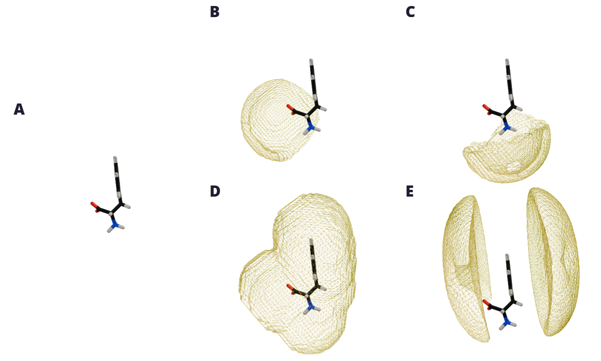


> Statistical Molecular Interaction Fields: A Fast and Informative Tool for Characterizing RNA and Protein-Binding Pockets.
> Diego Barquero Morera, Giovanni Mattiotti, Alexandar Kocev, Amshuman Rousselot, Louis Meuret, **Lucas Rouaud**, Hubert Santuz, Marc Baaden, Antoine Taly, and Samuela Pasquali.
> Journal of Chemical Theory and Computation 2025 21 (18), 9120-9135.
> DOI: 10.1021/acs.jctc.5c00688
{.small_note}

===

## Équations pour calculer les champs

$$
\begin{align}
\phi_{\text{liaison H}} &= - \sum_{\text{atome } i = 1}^{\text{atomes select.}} \exp\left( - \frac{(\mu_d - d_{\text{atome } i})^2}{2 \cdot \sigma^2_d} \right) \times \exp\left( - \frac{(\mu_\beta - \beta_{\text{atome } i})^2}{2 \cdot \sigma^2_\beta} \right) \\[1em]
\phi_{\text{hydroph.}} &= - \sum_{\text{espèce } i = 1}^{\text{espèces select.}} K_{\text{espèce}} \times \sum_{\text{atome } i = 1}^{\substack{\text{atomes} \\ \text{espèces select.}}} \exp\left( - \frac{(\mu_{\text{hydroph.}} - d_{\text{espèce}})^2}{2 \cdot \sigma^2_{\text{hydroph.}}} \right) \\[1em]
\phi_{\pi} &= - \sum_{\text{cycle } i = 1}^{\text{cycles select.}} \exp\left( - \frac{(\mathbf{v}_r - \mathbf{\mu}_{\pi})^\top \cdot \mathbf{S}_{\pi}^{-1} \cdot \mathbf{v}_r - \mathbf{\mu}_{\pi}}{2} \right) \\[1em]
\end{align}
$$

===

## Étapes pour filtrer les grilles

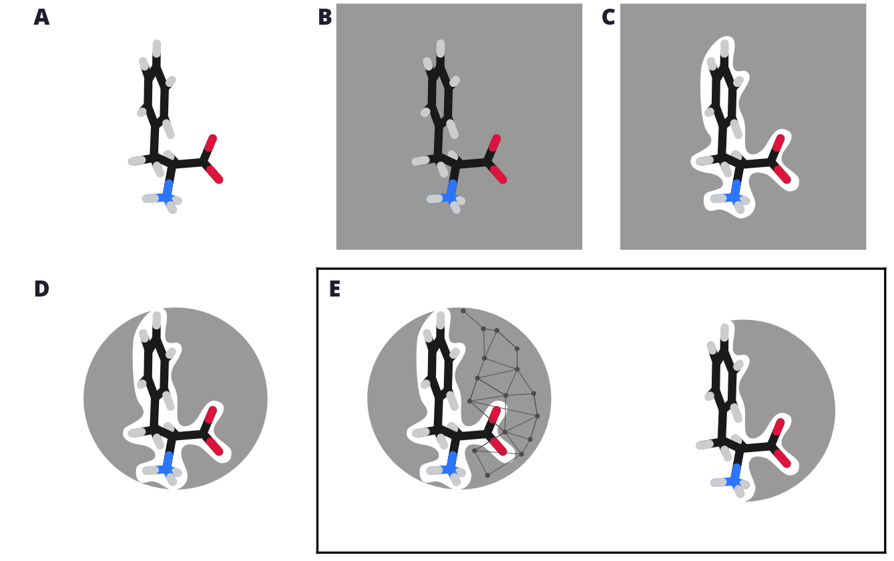

===

## Résultat



---

===

# Calcul des interactions directes

- **Utilisation de `strange` :**

    - logiciel développé ;

    - permet de calculer des pharmacophores en interactions ;

    - permet d'être générique, donc indépendant du système donnée en entrée (ARN, protéine, sucre, ligand, etc.) ;

    - les pharmacophores extraient peuvent être utilisés pour l'étape de génération des ligands.

===

## Définition d'un pharmacophore



Un pharmacophore désigne un ensemble de caractéristiques stériques et électroniques.
Cet ensemble est nécessaire pour garantir des interactions supramoléculaires optimales avec une structure cible biologique spécifique.
Ces interactions permettent de déclencher ou de bloquer la réponse biologique de la dite cible.

— D'après _IUPAC Recommendations 1998_

<split>

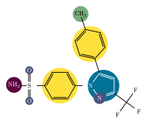


===

## Utilisation de critères géométriques pour détecter les différentes interactions

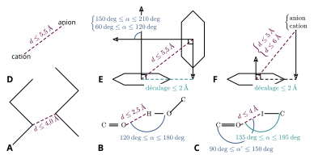

===

## Résultat



---

===

# Génération de nouveaux ligands

===

## Fonction de score

 

$$
\begin{aligned}
    pénalité &= recherché - correspond + max(0, généré - recherché) \\[1em]
    inverse(pénalité) &= \dfrac{1}{1 + pénalité} \\[1em]
    gaussienne(pénalité) &= \exp \left( - \dfrac{\left( pénalité \right)^2}{2 \cdot \sigma^2} \right) \\[1em]
\end{aligned}
$$

===



===

## Base de données de blocs

===

## Projection des blocs et des molécules

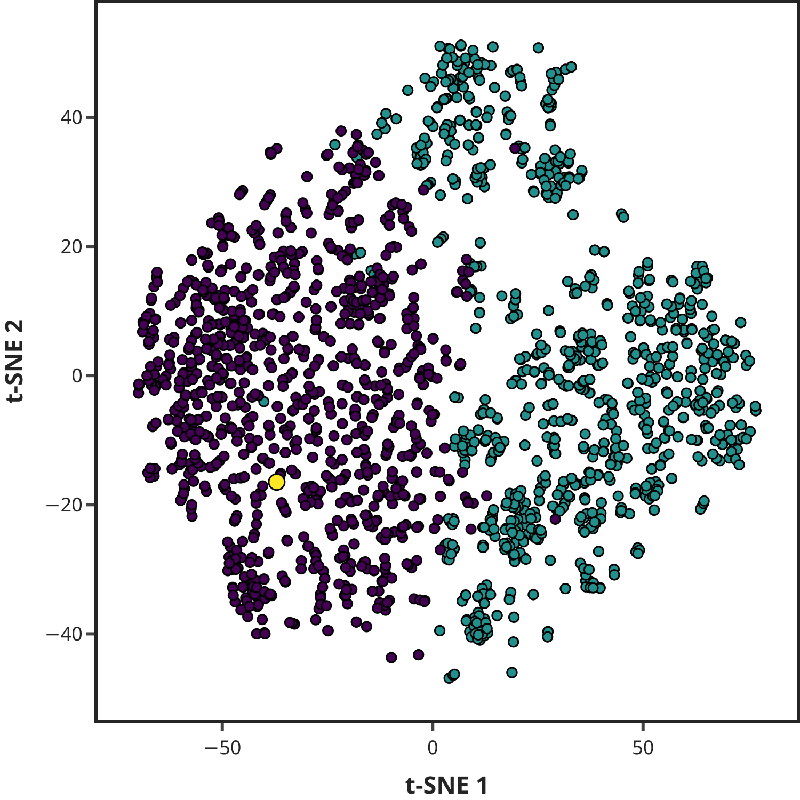

===

## Score par rapport à la génération des ligands

===

## Meilleures molécules générées

 


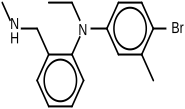
<split>
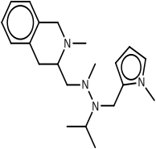
<split>
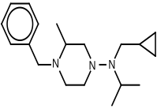
<split>


---

===

# Convertion des ligands au format adéquat

 

- filtrage « des atomes-ancres » (B, Hg, Mg, Np, Sn, U) ;
- filtrage des distance interatomiques anormales (0,7 à 3 Å) ;
- conversion au format `.pdbqt` via `meeko`.

===

## Résultat



---

===

# Amarrage moléculaire des nouveaux ligands

===

## Distribution des scores

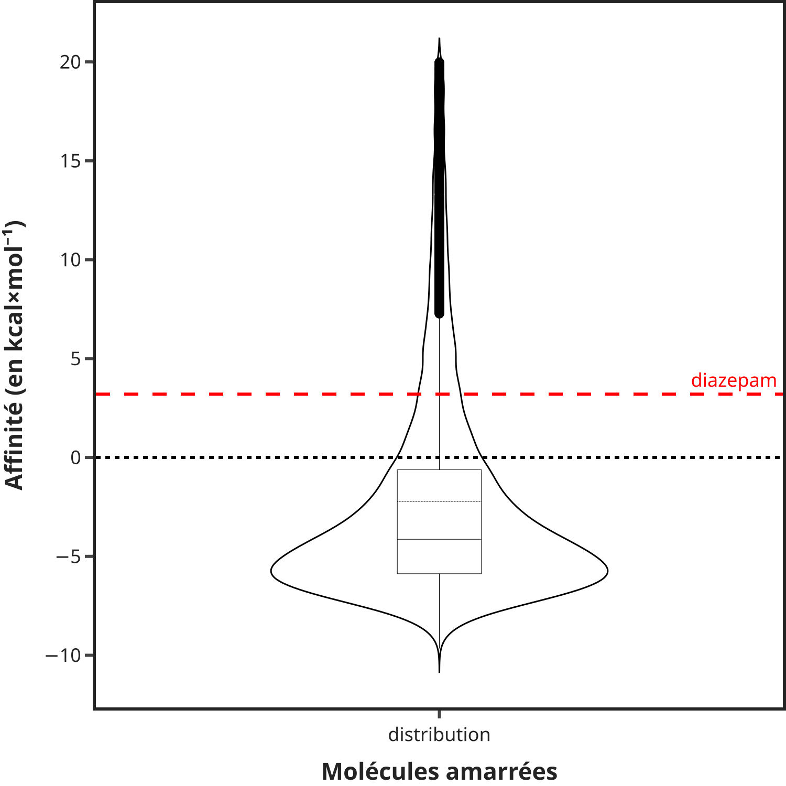

===

## Erreur de conversion au format `.pdbqt` du diazépam



===

## Score d'amarrage par rapport au score pharmacophore

===

## Interaction détectée après l'amarrage : `SyntheMol`



===

## Interaction détectée après l'amarrage : `Uni-Dock`



---

# Merci de votre attention

    
    
    
    
    
    

