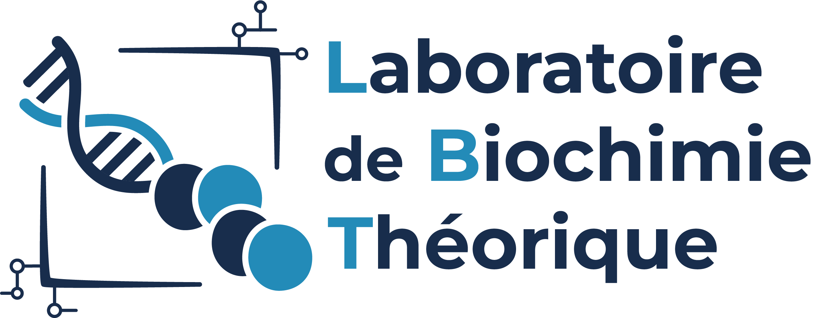
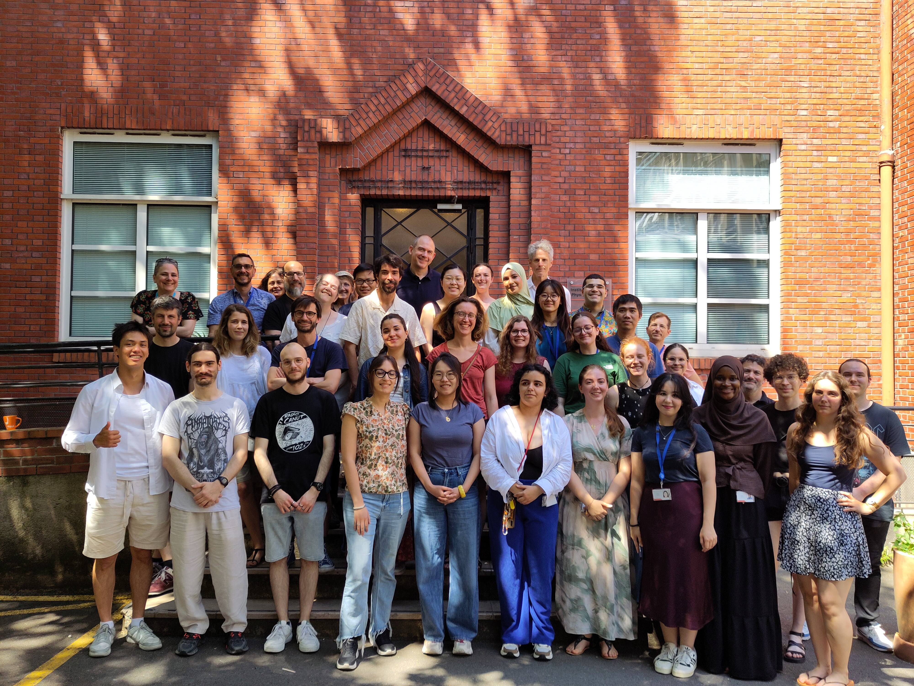
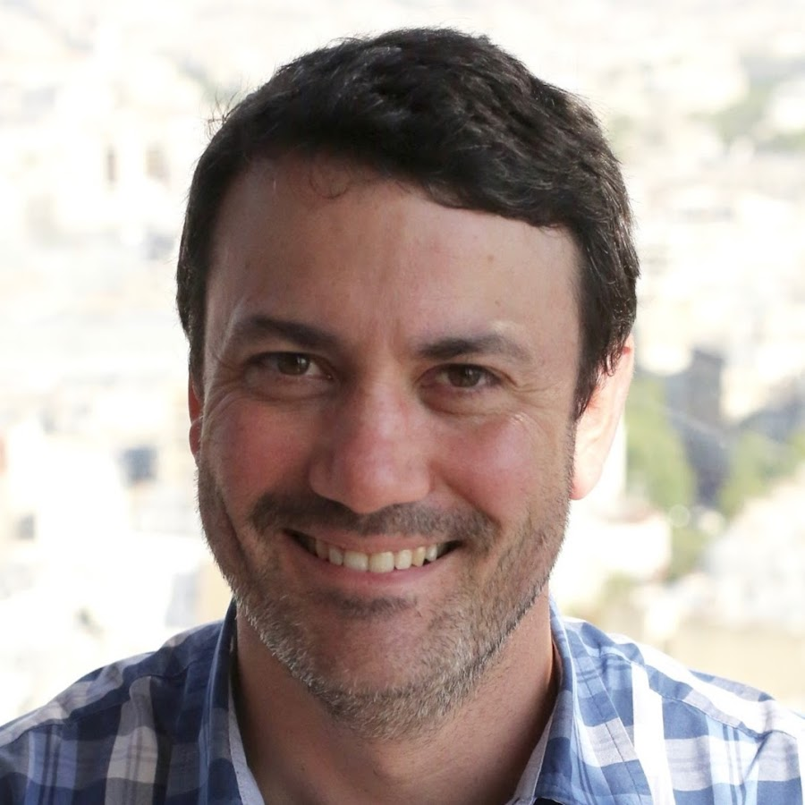

+++
title = "Soutenance de thèse"
date = 2026-10-23
description = "Combinaison de méthodes de visualisation à de l'IA générative dans le cadre du drug design"
theme="./static/style.css"
code_theme="lightfair"
+++

<h1 style="font-size: 3em;">Je ne sais qu'une chose,   c'est que je ne sais rien</h1>

**— Socrate**

---



<split>

<split>

<split>



 

# Visualization-driven pipeline for drug-design through generative AI

**Lucas ROUAUD**\
3^rd^ year PhD student

 



**Director:** Marc BAADEN\
**Codirector:** Antoine TALY

<split>

IBPC - LBT - UMR 8266 UPC/CNRS\
ED 388



---

# Présentation du système

---

# Préparation du système

---

# Calcul des champs d'interaction

---

# Calcul des interactions directes

---

# Génération de nouveaux ligands

---

# Convertion des ligands au format adéquat

---

# Amarrage moléculaire des nouveaux ligands

---

# Analyse des poses obtenues

---

# Merci de votre attention

    
    
    
    
    
    

