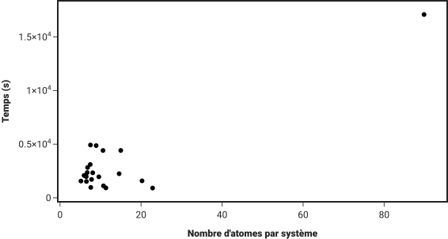
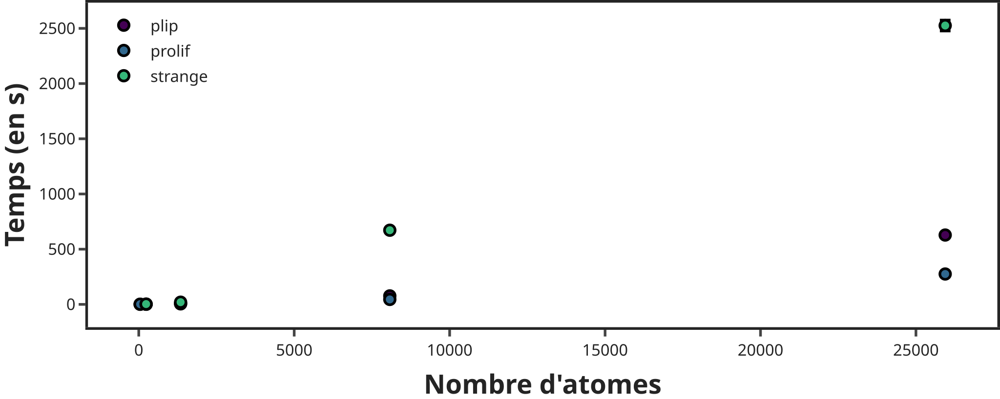
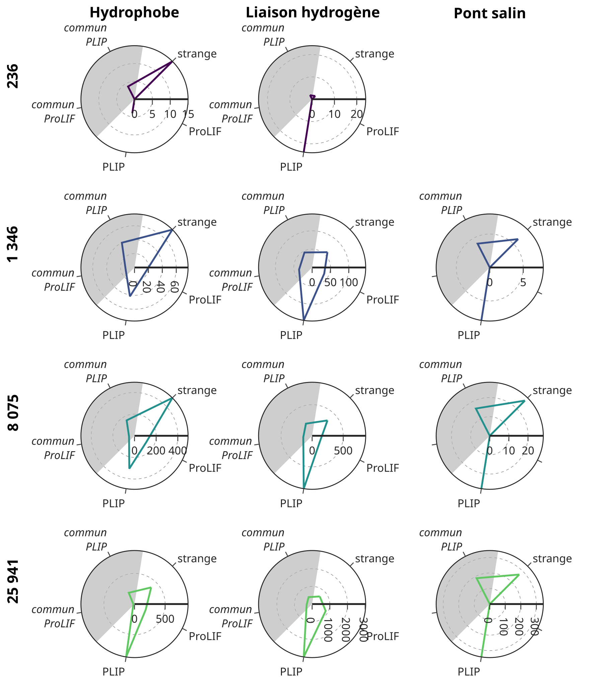

+++
title = "Soutenance de thèse"
date = 2026-10-23
description = "Combinaison de méthodes de visualisation à de l'IA générative dans le cadre du drug design"
theme="./static/style.css"
code_theme="lightfair"
+++

<h1 style="font-size: 3em;">Je ne sais qu'une chose,   c'est que je ne sais rien</h1>

**— Socrate**

---



<split>

<split>

<split>



 

# Combinaison de méthodes de visualisation à de l’intelligence artificielle générative dans le cadre de conception de médicament
 

**Lucas ROUAUD**\
23 octobre 2026

 



**Directeur:** Marc BAADEN\
**Codirecteur:** Antoine TALY

<split>

IBPC - LBT - UMR 8266 UPC/CNRS\
ED 388



---

# Présentation du système

===

## Structure



---

# Préparation du système

 

- Utilisation de deux scripts `Python` :
    - `extract_clean_protein.py` :
        1. extrait seulement la protéine d'intérêt ;
        2. lance `Modeller` pour combler les trous de la protéines (modèle « tout hydrogènes ») ;

    - `relax_system.py` :
        minimise le système pour le relaxer via `OpenMM`.

- RMSD entre les carbonnes alpha support (`6x3x`) et le système final de **0,2 Å**.

===

## Résultat



---

# Calcul des champs d'interaction

===

## Temps d'exécution

===

## Résultat



---

# Calcul des interactions directes

===

## Temps d'exécution

===

## Comparaison des interactions détectées

===

## Résultat



---

# Génération de nouveaux ligands

===

## Fonction de score

 

$$
\begin{aligned}
    pénalité &= recherché - correspond + max(0, généré - recherché) \\[1em]
    inverse(pénalité) &= \dfrac{1}{1 + pénalité} \\[1em]
    gaussienne(pénalité) &= \exp \left( - \dfrac{\left( pénalité \right)^2}{2 \cdot \sigma^2} \right) \\[1em]
\end{aligned}
$$

===



===

## Base de données de blocs

===

## Projection des blocs et des molécules

===

## Score par rapport à la génération des ligands

===

## Meilleures molécules générées

 



<split>

<split>

<split>


---

# Convertion des ligands au format adéquat

 

- filtrage « des atomes-ancres » (B, Hg, Mg, Np, Sn, U) ;
- filtrage des distance interatomiques anormales (0,7 à 3 Å) ;
- conversion au format `.pdbqt` via `meeko`.

===

## Résultat



---

# Amarrage moléculaire des nouveaux ligands

===

## Distribution des scores

===

## Erreur de conversion au format `.pdbqt` du diazépam



===

## Score d'amarrage par rapport au score pharmacophore

===

## Interaction détectée après l'amarrage : `SyntheMol`



===

## Interaction détectée après l'amarrage : `Uni-Dock`



---

# Merci de votre attention

    
    
    
    
    
    

